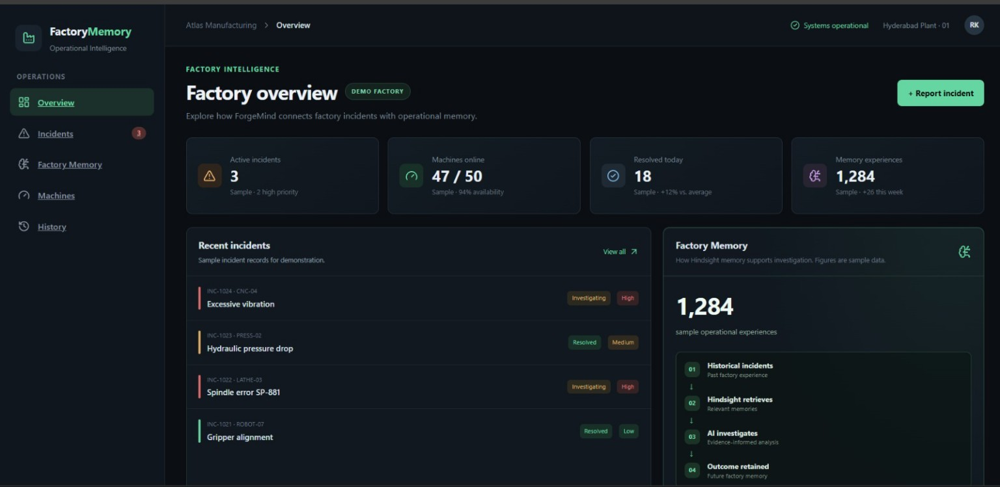
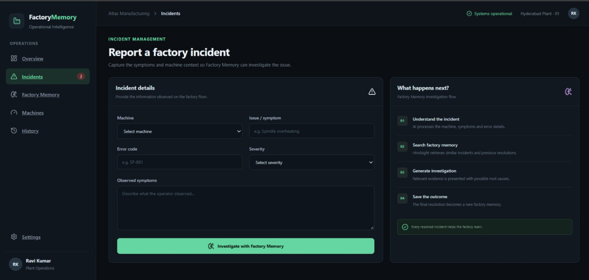
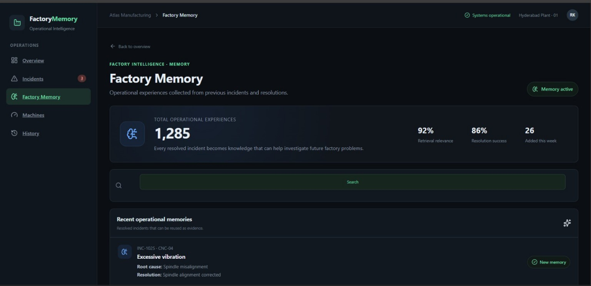
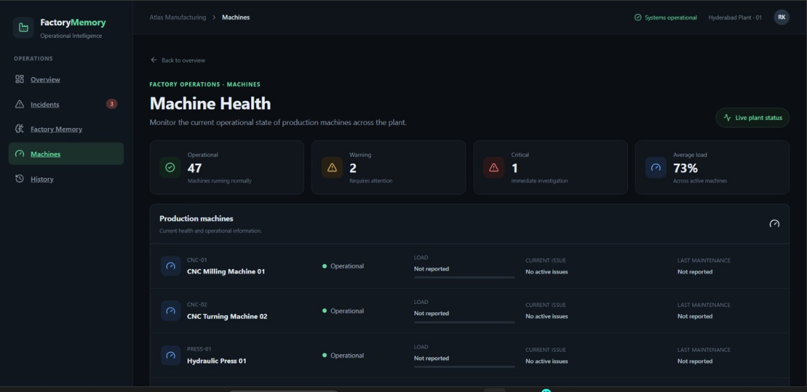
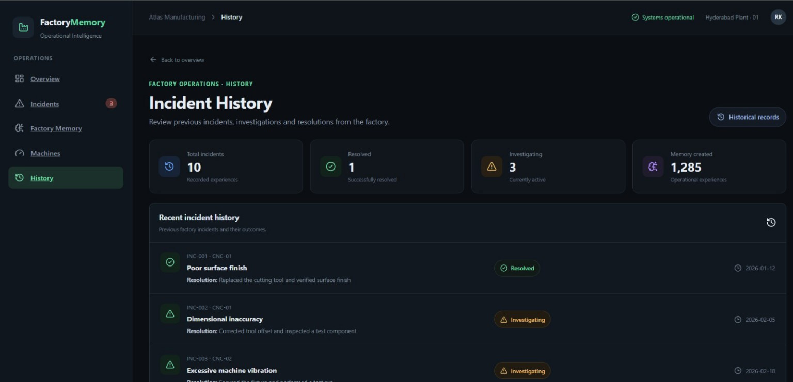
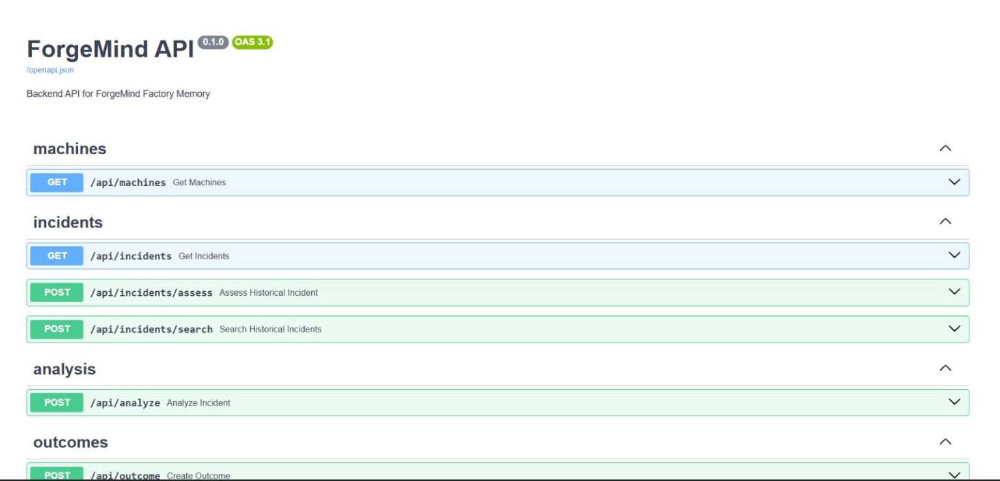
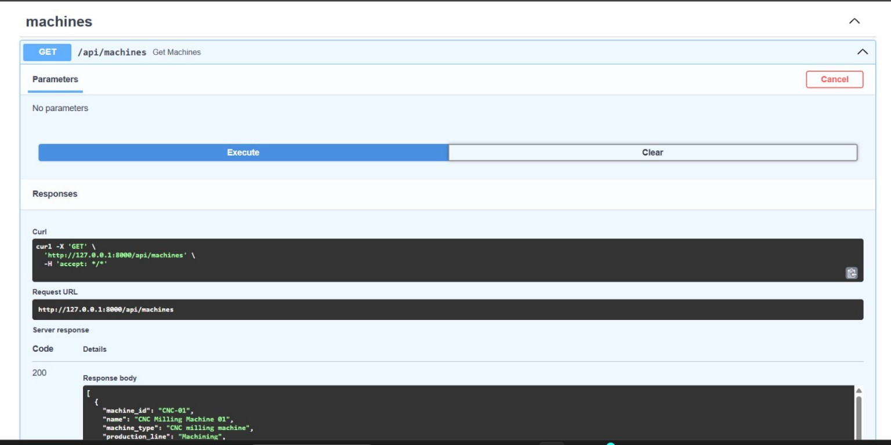

# ForgeMind

> **Factory operational memory that learns from every incident.**

ForgeMind is an AI-powered factory operations system that connects new incidents with historical operational experience.

Instead of treating every machine failure as a new problem, ForgeMind uses **Hindsight memory** to recall relevant incidents, reflect on historical evidence, generate investigation guidance, and retain the final outcome for future use.

**Built for Hack with Hyderabad 3.0 — AI Agents That Learn Using Hindsight.**

---

## The Learning Loop

```text
New Incident
     ↓
Historical Memory Recall
     ↓
Relevant Evidence
     ↓
AI Reflection & Investigation
     ↓
Engineer Action
     ↓
Observed Outcome
     ↓
Memory Retention
     ↓
Better Future Investigations
```

The important behavior is not simply "AI gives a recommendation."

It is:

**RECALL → REFLECT → ACT → RETAIN → RECALL**

A resolved incident becomes operational memory that can inform a later investigation.

---

## Why ForgeMind?

Factory teams repeatedly encounter similar operational problems:

- The same machine develops recurring issues.
- Experienced engineers may know the previous solution, but that knowledge is difficult to retrieve.
- Incident reports often contain useful historical information that is not actively reused.
- A conventional AI assistant can generate a recommendation without remembering what actually happened previously.

ForgeMind addresses this by turning resolved incidents into **reusable operational memory**.

---

## Core Workflow

### 1. Report an incident

An engineer provides:

- Machine
- Issue / symptom
- Severity
- Error information
- Observed symptoms

### 2. Recall factory memory

ForgeMind sends the incident context to Hindsight and searches for historically relevant operational experiences.

### 3. Generate an investigation

Historical evidence is passed into the reasoning process to produce:

- Investigation summary
- Relevant historical evidence
- Recommended investigation steps
- Memory provenance

### 4. Resolve the incident

The engineer records:

- Confirmed root cause
- Action taken
- Result
- Resolution status
- Additional notes

### 5. Retain the outcome

The resolution becomes a new operational memory.

That experience can subsequently influence investigation of similar incidents.

---

## Hindsight Memory

**Hindsight is central to ForgeMind rather than being an optional search layer.**

ForgeMind uses Hindsight for three core memory operations:

| Operation | Role |
|---|---|
| **Recall** | Retrieve operational experiences relevant to the current incident |
| **Reflect** | Use historical evidence to reason about the current incident |
| **Retain** | Store the engineer's observed outcome for future use |

### Recall

```text
Current incident
      ↓
Hindsight Recall
      ↓
Historical experiences
```

### Reflect

```text
Current incident + historical evidence
                ↓
        Hindsight Reflection
                ↓
       Investigation guidance
```

### Retain

```text
Engineer action + observed outcome
                ↓
        Hindsight Retention
                ↓
        Future operational memory
```

---

## Architecture

```text
┌─────────────────────────────────────────────┐
│                 React Frontend              │
│                                             │
│ Dashboard · Incident · Investigation        │
│ Resolution · Factory Memory · History       │
└──────────────────────┬──────────────────────┘
                       │ HTTP
                       ▼
┌─────────────────────────────────────────────┐
│              FastAPI Backend                │
│                                             │
│ Machines · Incidents · Search               │
│ Assessment · Analysis · Outcomes            │
└──────────────────────┬──────────────────────┘
                       │ Analysis / Outcome
                       ▼
┌─────────────────────────────────────────────┐
│              M1 AI + Memory Layer           │
│                                             │
│ Incident reasoning                          │
│ Hindsight Recall                            │
│ Hindsight Reflection                        │
│ Hindsight Retention                         │
└──────────────────────┬──────────────────────┘
                       │
             ┌─────────┴─────────┐
             ▼                   ▼
      ┌──────────────┐    ┌──────────────┐
      │   Hindsight  │    │  LLM Layer   │
      │    Memory    │    │    / Groq    │
      └──────────────┘    └──────────────┘
```

---

## Screenshots

### Factory Overview

Dashboard with incident, machine, resolution, and memory summaries.

<p align="center">
  
</p>

### Incident Reporting

Capture a machine, issue, severity, and observed symptoms before starting an investigation.

<p align="center">
  
</p>

### Factory Memory

Review operational memories from resolved incidents and search prior experience.

<p align="center">
  
</p>

### Machine Health

Review machine status, reported load, current issues, and maintenance information.

<p align="center">
  
</p>

### Incident History

Review recorded incidents, investigation status, and resolutions.

<p align="center">
  
</p>

### Backend API

The FastAPI OpenAPI UI documents the machine, incident, analysis, and outcome endpoints.

<p align="center">
  
</p>

### API Response

Example successful API request and response.

<p align="center">
  
</p>

---

## Application Components

### Frontend

Built with:

- React
- Vite
- React Router
- Lucide React

Main application areas:

- Factory Overview
- Incident Reporting
- AI Investigation
- Incident Resolution
- Factory Memory
- Machine Health
- Incident History
- Settings

### Backend

Built with:

- Python
- FastAPI
- Pydantic
- HTTPX
- Uvicorn

The backend provides:

| Method | Endpoint | Purpose |
|---|---|---|
| `GET` | `/api/health` | Backend health check |
| `GET` | `/api/machines` | Retrieve factory machines |
| `GET` | `/api/incidents` | Retrieve historical incidents |
| `POST` | `/api/incidents/search` | Search historical incidents |
| `POST` | `/api/incidents/assess` | Assess a stored incident |
| `POST` | `/api/analyze` | Analyze a new incident through M1 |
| `POST` | `/api/outcome` | Retain an incident outcome through M1 |

Interactive API documentation is available at:

`http://127.0.0.1:8000/docs`

### M1 — AI + Hindsight Memory

The M1 layer owns the AI and operational-memory boundary.

Responsibilities include:

- Hindsight integration
- Memory recall
- Memory reflection
- Memory retention
- Historical evidence extraction
- Incident analysis
- Investigation recommendations
- Outcome-to-memory learning

---

## Repository Structure

```text
ForgeMind/
├── backend/
│   ├── app/
│   │   ├── api/
│   │   └── schemas/
│   └── requirements.txt
│
├── frontend/
│   ├── src/
│   │   ├── components/
│   │   ├── pages/
│   │   └── services/
│   └── package.json
│
├── m1/
│   ├── ai/
│   ├── hindsight/
│   ├── services/
│   └── README.md
│
├── data/
│   ├── machines.json
│   ├── incidents.json
│   └── test_cases.json
│
├── docs/
│   └── architecture.md
│
├── screenshots/
│   ├── 01-dashboard.png
│   ├── 02-incident-report.png
│   ├── 03-historical-memory.png
│   ├── 04-machine-health.png
│   ├── 05-incident-history.png
│   ├── 06-backend-api.png
│   └── 07-api-response.png
│
├── package.json
├── package-lock.json
└── README.md
```

---

## Demo Data

ForgeMind includes synthetic factory data covering machines and historical incidents.

Examples include:

- CNC machines
- Hydraulic presses
- Coolant systems
- Conveyors
- Surface-finish defects
- Dimensional inaccuracies
- Machine vibration
- Coolant problems
- Hydraulic pressure problems
- Conveyor issues

> The data is intended for demonstration and hackathon prototyping rather than production factory deployment.

---

## Running ForgeMind Locally

ForgeMind consists of three logical layers:

```text
Frontend
   ↓
FastAPI Backend
   ↓
M1 AI + Hindsight
```

### Prerequisites

Install:

- Git
- Node.js
- npm
- Python 3
- pip
- Access to the configured Hindsight service
- Hindsight API credentials
- Groq API credentials when using the Groq reasoning layer

### Frontend

From the repository root:

```bash
cd frontend
npm install
npm run dev
```

Vite will print the local development URL.

The frontend API client uses `http://127.0.0.1:8000` by default.

You can override it with:

```text
VITE_API_BASE_URL
```

### FastAPI Backend

From the repository root:

```bash
python -m venv .venv

# Windows
.venv\Scripts\activate

# macOS / Linux
source .venv/bin/activate

python -m pip install -r backend/requirements.txt
python -m uvicorn app.main:app --app-dir backend --reload --port 8000
```

Backend:

`http://127.0.0.1:8000`

Swagger:

`http://127.0.0.1:8000/docs`

Health check:

`http://127.0.0.1:8000/api/health`

### M1 + Hindsight Configuration

The memory layer uses:

```text
HINDSIGHT_BASE_URL=
HINDSIGHT_API_KEY=
HINDSIGHT_BANK_ID=
```

The Groq reasoning integration uses:

```text
GROQ_API_KEY=
```

Do not commit real credentials to GitHub.

Use a local `.env` file for development.

> **Integration note:** the current `main` branch contains the M1 memory adapters under `m1/`. The standalone M1 server/runtime integration is being consolidated separately; do not assume a `m1-runtime/` directory exists on `main`.

---

## End-to-End Flow

```text
1. Open ForgeMind
        ↓
2. Report a factory incident
        ↓
3. Start an investigation
        ↓
4. Backend sends the incident to M1
        ↓
5. M1 recalls relevant Hindsight memories
        ↓
6. Historical evidence is returned
        ↓
7. AI generates investigation guidance
        ↓
8. Engineer records the resolution
        ↓
9. Outcome is retained in Hindsight
        ↓
10. A future similar incident can retrieve that experience
```

---

## Demonstrating the Learning Effect

The strongest demonstration is the difference between the first occurrence and a later similar occurrence.

### First incident

```text
Incident
   ↓
Little / no relevant historical memory
   ↓
Investigation
   ↓
Engineer resolves incident
   ↓
Outcome retained
```

### Similar incident later

```text
Similar incident
       ↓
Hindsight recall
       ↓
Previous experience retrieved
       ↓
Historical evidence displayed
       ↓
AI investigation informed by previous outcome
```

This demonstrates the difference between a stateless AI workflow and a memory-powered operational workflow.

---

## API Examples

### Health Check

```bash
curl http://127.0.0.1:8000/api/health
```

Expected response:

```json
{
  "status": "ok"
}
```

### Retrieve Machines

```bash
curl http://127.0.0.1:8000/api/machines
```

### Retrieve Historical Incidents

```bash
curl http://127.0.0.1:8000/api/incidents
```

### Analyze an Incident

`POST /api/analyze`

Example payload:

```json
{
  "incidentId": "INC-DEMO-001",
  "machineId": "CNC-01",
  "timestamp": "2026-09-30T10:00:00Z",
  "title": "Spindle overheating",
  "description": "Spindle temperature is increasing after extended operation.",
  "symptoms": [
    "increased spindle temperature",
    "reduced coolant flow"
  ]
}
```

### Retain an Outcome

`POST /api/outcome`

Example:

```json
{
  "incidentId": "INC-DEMO-001",
  "actionTaken": "Cleaned the coolant filter and verified coolant flow.",
  "result": "Temperature returned to normal.",
  "resolutionStatus": "resolved",
  "notes": "Resolved during maintenance inspection."
}
```

---

## Safety and Data Scope

ForgeMind is a hackathon prototype.

The repository uses synthetic factory data and does not directly control physical machinery.

Recommendations generated by ForgeMind are intended to support investigation and knowledge retrieval, not replace qualified engineering procedures, safety controls, lockout/tagout procedures, or authorized maintenance decisions.

---

## Project Documentation

- [Architecture](docs/architecture.md)
- [M1 documentation](m1/README.md)

The architecture documentation describes the intended:

**Recall → Reflect → Recommend → Act → Retain → Recall**

learning loop.

---

## Technology Stack

| Layer | Technology |
|---|---|
| Frontend | React |
| Build Tool | Vite |
| Routing | React Router |
| UI Icons | Lucide React |
| Backend | FastAPI |
| API Validation | Pydantic |
| Backend HTTP | HTTPX |
| Runtime | Uvicorn |
| AI / Reasoning | LLM integration |
| AI Provider | Groq |
| Persistent Memory | Hindsight |
| Data | JSON |
| Languages | JavaScript / Python |

---

## What Makes ForgeMind Different?

ForgeMind is designed around **operational memory**, not simply conversational AI.

```text
Past operational experience
          ↓
     becomes memory
          ↓
   memory becomes evidence
          ↓
 evidence informs investigation
          ↓
 new outcome becomes memory
```

Every resolved incident can therefore contribute to the knowledge available for future incidents.

---

## Team

**ForgeMind — Hack with Hyderabad 3.0**

Built as a collaborative prototype focused on AI-powered factory operational memory.

---

## Status

ForgeMind demonstrates:

- Factory incident management
- Historical operational memory
- Hindsight recall
- Hindsight reflection
- AI-assisted investigation
- Outcome retention
- Memory-powered future investigations
